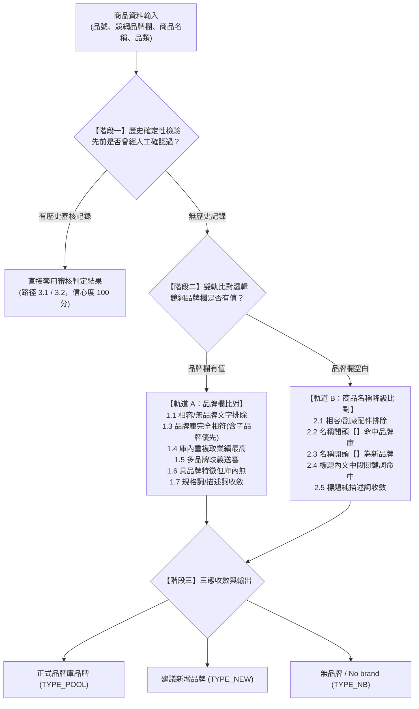

# 競網品牌對應作業說明書：決策體系、判定規則與輸出標準

> **版本**：v1.5　｜　**適用範圍**：momo 全站商品（545,572 品號）　｜　**最後更新**：2026/09/21

---

## 1. 專案目標與核心原則

### 1.1 業務痛點與專案目標
電商競網（momo）商品中，品牌欄位填寫格式極度混亂，常見「中英並列」、「母子品牌重疊」、「型號規格混入品牌欄」、「空白未填」或「副廠周邊配件借用原廠名稱」等現象。

本專案之核心目標在於建立一套**高精準度、可重複執行、具備自學習記憶之品牌標準化對應系統**，將競網商品全數標準化對應至既有之正式品牌庫，產出一致、乾淨且去重的商品品牌主檔。

### 1.2 三大不變原則
為確保跨品類、跨批次之資料標準完全一致，系統全流程嚴格貫徹以下三大原則：

1. **最具體子品牌優先**
   - 不論 3C 科技、美妝或居家生活，全品類標準保持一致：**當母品牌與子品牌同時存在於品牌庫時，優先歸入最具體的子品牌**。
     - 例：`Apple iPhone 15` ➔ 同時包含 Apple 與 iPhone ➔ **歸入 `iphone`**。
     - 例：`ASUS ROG 電競主機板` ➔ 同時包含 ASUS 與 ROG ➔ **歸入 `ROG`**。
     - 例：`Kanebo KATE 凱婷 眉筆` ➔ 同時包含 Kanebo 與 KATE ➔ **歸入 `KATE 凱婷`**。
   - 若子品牌尚未收錄於品牌庫，則依現有資料邊界歸入母品牌（例：`Apple iPad Air` ➔ 庫內無 iPad 品牌 ➔ **歸入 `Apple`**），不自行憑空建立未經核准之代碼。

2. **品類邊界隔離（杜絕跨類誤判）**
   - 比對時優先校驗商品所屬之一級品類。
   - 若商品文字僅局部包含某個品牌名稱，但兩者品類完全不符，系統判定為不相符。例如書籍類漫畫《KING GOLF》內含單字 `GOLF`，而品牌庫中的 `GOLF` 登記為汽車配件，系統直接否決，防止跨領域誤對應。

3. **相容周邊與副廠收斂為無品牌**
   - 手機保護貼、副廠手把配件、轉接線等商品，其本體並非原廠品牌。系統一律將相容描述（如「適用 iPhone」、「Switch 副廠」）辨識為周邊配件，**收斂為無品牌（No brand）**，避免污染原廠品牌庫銷售統計。

---

## 2. 總體決策體系與判定流程

### 2.1 全局決策流程架構
系統判定任何一筆商品時，依循由高確定性到模糊特徵的層次進行嚴格檢驗：



---

### 2.2 具體決策路徑對照表

點擊下方區塊可展開檢視各軌道之詳細判定條件、代碼與實例說明：

???+ info "軌道 A：品牌欄有填之決策路徑 (1.1 ～ 1.7)"
    | 路徑代碼 | 判定情況 | 輸出類型 | 預設信心度 | 典型範例說明 |
    |:---:|:---|:---:|:---:|:---|
    | **1.1** | 品牌欄文字明確標示無品牌 | <span class="badge badge-nb">TYPE_NB</span> | 97 | 品牌欄填寫「無品牌」、「其他」、「自有品牌」、「OEM」 |
    | **1.2** | 品牌欄文字為相容性描述 | <span class="badge badge-nb">TYPE_NB</span> | 90 | 品牌欄填寫「適用 iPhone 充電線」、「相容 Switch 手把」 |
    | **1.3** | 品牌庫完全相符（含子品牌優先） | <span class="badge badge-pool">TYPE_POOL</span> | 96 | 「BURBERRY」完全相符；「Apple iPhone」取子品牌 `iphone` |
    | **1.4** | 品牌庫有多筆重複建檔，取業績最高 | <span class="badge badge-pool">TYPE_POOL</span> | 90 | 品牌庫同時有 `Nintendo` 與重複代碼，取歷史銷售最高之主要 ID |
    | **1.5** | 多個不同品牌同時相符，存在歧義 | <span class="badge badge-pool">TYPE_POOL</span> | 39 | 品牌欄填「日本」，同時命中多個包含日本的品牌，列入待審 |
    | **1.6** | 具明確商標特徵，但現有品牌庫未收錄 | <span class="badge badge-new">TYPE_NEW</span> | 82 | 「良值」、「RedMoon」，字面具商標特徵但庫內查無，建議新增 |
    | **1.7** | 品牌欄內容實為規格或促銷描述詞 | <span class="badge badge-nb">TYPE_NB</span> | 80 | 品牌欄填寫「特價出清」、「收納用品」、「買一送一」 |

???+ info "軌道 B：品牌欄空白之降級比對路徑 (2.1 ～ 2.5)"
    | 路徑代碼 | 判定情況 | 輸出類型 | 預設信心度 | 典型範例說明 |
    |:---:|:---|:---:|:---:|:---|
    | **2.1** | 商品為配件、耗材或相容周邊 | <span class="badge badge-nb">TYPE_NB</span> | 88 | 標題「iPhone 15 鋼化膜」、「MacBook 磁吸防窺片」，本體非原廠 |
    | **2.2** | 商品名稱開頭【】命中現有品牌庫 | <span class="badge badge-pool">TYPE_POOL</span> | 86 | 商品名稱為「【AMANO】原廠打卡紙」，成功提取 `AMANO` |
    | **2.3** | 商品名稱開頭【】具品牌特徵但庫內無 | <span class="badge badge-new">TYPE_NEW</span> | 72 | 商品名稱為「【MEIDIAN】固體面膜」，提取新品牌名稱 |
    | **2.4** | 由商品標題內文中段比對到品牌 | <span class="badge badge-pool">TYPE_POOL</span> | 52 | 標題內文中段出現特定長品牌名（非配件情境） |
    | **2.5** | 標題與內文皆無可信品牌資訊 | <span class="badge badge-nb">TYPE_NB</span> | 85 | 標題為純描述性文字（如「加厚純棉吸水毛巾 3 入裝」） |

???+ info "歷史記憶容器與人工覆蓋機制 (3.1 ～ 3.2)"
    這兩條路徑是系統的**「自動記憶容器」**，不需要人員事前手動逐筆設定：
    
    * **3.1 套用歷史審核品牌字串（全站共用）**：
      當某個品牌字串先前已由人工或 Temp 在審核總表中確認過（例如確認「綠鐘」對應為 `GREEN BELL`），該決策永久存入資料庫。日後全站 22 個品類只要再次出現該字串，系統直接套用（信心度 100 分），絕不被演算法推翻。
    * **3.2 套用單一品號例外覆蓋（單品專屬）**：
      僅用於極少數「字串本身不宜全域更動，但該單一特例品號需個別指定」之情境（信心度 100 分）。

---

## 3. 系統輸出規格與真實資料範例

### 3.1 三大標準輸出類型定義
系統產出的每筆商品最終收斂為以下三態之一，各自對應明確的後續處理機制：

| 輸出類型 | 定義說明 | 系統標記 | 後續處置 |
|:---|:---|:---:|:---|
| **品牌庫正式品牌** | 商品成功對應至現有正式品牌庫 | <span class="badge badge-pool">TYPE_POOL</span> | 指派正式 `suggest brand id`，直接對齊主數據供業務與報表使用。 |
| **建議新增品牌** | 商品具明確品牌商標，但現有品牌庫尚未收錄 | <span class="badge badge-new">TYPE_NEW</span> | 產出建議名單，供品牌庫管理者評估建檔，維護品牌庫完整性。 |
| **無品牌 (No brand)** | 白牌、通用規格品、或非原廠之相容周邊配件 | <span class="badge badge-nb">TYPE_NB</span> | 記錄判定原因（如相容配件、通用規格等），不指派代碼。 |

---

### 3.2 輸出報表綱要與欄位定義 (Schema)

每批次執行完成後產出之品類結果檔（`output/momo/<品類>_result.xlsx`）包含以下核心欄位：

| 欄位名稱 | 資料型態 | 範例內容 | 說明 |
|:---|:---:|:---|:---|
| **品號** | 數字/文字 | `10000402` | 競網商品唯一識別代碼 |
| **l1** | 文字 | `Beauty` | 商品所屬之一級品類 |
| **brand** | 文字 | `BURBERRY 巴寶莉` | 競網商品原始品牌欄位內容（若空白則為 nan） |
| **title** | 文字 | `【BURBERRY 巴寶莉】風格男性淡香水` | 競網商品原始標題 |
| **suggest brand name** | 文字 | `Burberry` | 系統最終建議對應之品牌名稱（或標示建議新增 / No brand） |
| **suggest brand id** | 數字 | `1146353` | 正式品牌庫品牌 ID（若為新品牌或無品牌則為空） |
| **新增品牌名稱** | 文字 | `良值` | 若判定為建議新增品牌，此處填入提取出之新品牌字串 |
| **No brand原因** | 文字 | `相容/副廠配件` | 若判定為無品牌，此處記錄判定依據 |
| **信心度** | 整數 | `96` | 系統計算之量化信心分數（0～100 分） |
| **判斷路徑** | 文字 | `1.3 品牌欄完全相符` | 該筆判定所命中之具體規則節點編號與名稱 |

---

### 3.3 真實產出資料抽樣範例

以下為直接取自系統實際運算產出之真實商品抽樣記錄，涵蓋各典型決策場景：

| 品號 | 品類 (l1) | 競網品牌欄 | 商品名稱 (節錄) | 最終判定品牌 | 品牌 ID | 判定類型 | 判斷路徑 | 信心度 |
|:---:|:---|:---|:---|:---:|:---:|:---:|:---|:---:|
| `10000402` | Beauty | BURBERRY 巴寶莉 | 【BURBERRY 巴寶莉】風格男性淡香水 EDT 100ml | **Burberry** | `1146353` | <span class="badge badge-pool">TYPE_POOL</span> | 1.3 品牌欄完全相符 | <span class="badge badge-score">96</span> |
| `10007337` | Game Kingdom | Nintendo 任天堂 | 【Nintendo 任天堂】NS Switch SEGA 遊戲合輯 | **Nintendo** | `1146819` | <span class="badge badge-pool">TYPE_POOL</span> | 1.4 重複取業績最高 | <span class="badge badge-score">90</span> |
| `10000180` | Mobile & Gadgets | *(空白)* | 【AMANO】原廠標誌 六欄位打卡紙 3包入 | **AMANO** | `1085916` | <span class="badge badge-pool">TYPE_POOL</span> | 2.2 標題【】提取 | <span class="badge badge-score">86</span> |
| `10233164` | Game Kingdom | 良值 | 【良值】Switch 副廠手把專用腕帶 2入 | *(建議品牌庫新增)* | `-` | <span class="badge badge-new">TYPE_NEW</span> | 1.6 品牌庫未收錄 | <span class="badge badge-score">82</span> |
| `10002654` | Mobile & Gadgets | RedMoon | 【RedMoon】Xiaomi 小米12 防摔透明手機軟殼 | *(建議品牌庫新增)* | `-` | <span class="badge badge-new">TYPE_NEW</span> | 1.6 品牌庫未收錄 | <span class="badge badge-score">82</span> |
| `10001894` | Mobile & Gadgets | *(空白)* | 【台灣製造防窺片】MacBook Pro 16吋螢幕磁吸防窺片 | **No brand** | `-` | <span class="badge badge-nb">TYPE_NB</span> | 2.1 配件/相容品排除 | <span class="badge badge-score">88</span> |
| `10225061` | Game Kingdom | *(空白)* | 【ipega】副廠 Switch 運動指套健身配件 | **No brand** | `-` | <span class="badge badge-nb">TYPE_NB</span> | 2.1 配件/相容品排除 | <span class="badge badge-score">88</span> |

> **抽樣解讀**：
> - 範例 1、2 呈現品牌欄有值時，標準品牌之直接命中與重複品牌自動取大機制。
> - 範例 3 呈現品牌欄空白時，系統自動從標題括號提取品牌並正確關聯之能力。
> - 範例 4、5 呈現具備商業品牌特徵（良值、RedMoon）但品牌庫暫無之項目，自動歸入建議新增名單，不造成髒資料。
> - 範例 6、7 呈現非原廠之周邊相容品（MacBook 防窺片、Switch 副廠指套），精準識別為周邊配件並收斂為無品牌，確保原廠品牌數據純淨。

---

## 4. 全站成效總覽與品質分級管理

### 4.1 信心度分級與風險控管
系統為每一筆判定結果計算 0～100 分之量化信心指標，作為品質把關與人工抽檢之標準分流依據：

| 信心度區間 | 確定等級 | 商品佔比 | 品質定義與作業機制 |
|:---:|:---:|:---:|:---|
| **90～100 分** | 高度確定 | **75.5%** | 規則完全命中、品牌庫唯一相符或已獲歷史審核確認。**全自動採用，無須人工介入**。 |
| **75～89 分** | 大致可信 | **18.4%** | 配件排除、標題開頭品牌或長字串正規化相符。**系統標註抽檢星號（★），各品類僅需抽檢約 30 筆**。 |
| **0～74 分** | 需人工確認 | **6.1%** | 包含全新未知品牌、多品牌同分歧義或高疑義縮寫。**系統自動打包為單一總表交由 Temp 審核**。 |

---

### 4.2 全站 22 個品類目前對應成果總覽

針對 momo 全站 545,572 品號進行全量運算後，各品類之分佈表現如下：

| 一級品類 (Level 1) | 所屬群組 | 品號總數 | 品牌字串數 | 待審字串數 | 待審品號 (佔比) | 品牌庫命中率 | 建議新增率 | 無品牌率 |
|:---|:---:|---:|---:|---:|---:|:---:|:---:|:---:|
| **Books** | Lifestyle | 169,340 | 2,241 | 52 | 858 (1%) | 82% | 17% | 1% |
| **Home & Living** | FMCG | 84,916 | 14,360 | 3,478 | 12,696 (15%) | 65% | 24% | 11% |
| **Mother & Baby** | FMCG | 48,602 | 2,887 | 532 | 2,829 (6%) | 82% | 16% | 2% |
| **Mobile & Gadgets** | Electronics | 43,768 | 6,178 | 358 | 2,231 (5%) | 70% | 7% | 23% |
| **Beauty** | FMCG | 38,513 | 3,870 | 931 | 3,291 (9%) | 87% | 10% | 3% |
| **Hardware & 3C** | Electronics | 31,727 | 2,577 | 410 | 2,411 (8%) | 82% | 11% | 7% |
| **Food & Beverages** | FMCG | 24,466 | 3,609 | 736 | 1,889 (8%) | 73% | 17% | 10% |
| **Health** | FMCG | 17,821 | 2,303 | 412 | 1,513 (8%) | 80% | 16% | 4% |
| **Sports & Outdoors** | Lifestyle | 15,486 | 3,508 | 802 | 2,055 (13%) | 64% | 24% | 12% |
| **Home Electronic** | Electronics | 13,600 | 2,405 | 435 | 1,195 (9%) | 78% | 12% | 10% |
| **Pets** | FMCG | 10,167 | 2,124 | 433 | 1,229 (12%) | 69% | 20% | 11% |
| **Women's Apparel** | Fashion | 9,221 | 420 | 100 | 304 (3%) | 68% | 27% | 5% |
| **Women Accessories** | Fashion | 8,104 | 1,605 | 400 | 972 (12%) | 49% | 39% | 12% |
| **Life & Entertainment** | Lifestyle | 6,623 | 641 | 196 | 295 (4%) | 71% | 25% | 4% |
| **Motors** | Lifestyle | 6,478 | 1,444 | 261 | 756 (12%) | 69% | 18% | 13% |
| **Women Bags** | Fashion | 4,101 | 1,151 | 307 | 612 (15%) | 57% | 30% | 13% |
| **Men's Bags& Accessories** | Fashion | 3,373 | 483 | 106 | 252 (7%) | 78% | 17% | 5% |
| **Everything Else** | Lifestyle | 3,354 | 504 | 105 | 273 (8%) | 71% | 22% | 7% |
| **Game Kingdom** | Electronics | 2,469 | 193 | 35 | 112 (5%) | 92% | 2% | 6% |
| **Men's Apparel** | Fashion | 2,205 | 158 | 35 | 122 (6%) | 77% | 22% | 1% |
| **Shoes** | Fashion | 1,199 | 400 | 125 | 226 (19%) | 54% | 35% | 11% |
| **Tickets & Services** | Lifestyle | 39 | 7 | 1 | 1 (3%) | 97% | 3% | 0% |
| **全站總計** | — | **545,572** | **45,344** | **10,949** | **33,119 (6.1%)** | **75.5%** | **17.3%** | **7.2%** |

> **成效摘要**：
> - 全站 545,572 件商品中，高達 **93.9%** 已達成高確定性自動對應。
> - 僅剩 **6.1%**（約 3.3 萬件商品，去重後約 1 萬個品牌字串）集中納入審核名單，極大化節省人工作業成本。

---

## 5. 待審資料之人機協同作業流程

針對前述 6.1% 需人工確認之項目，系統建立標準化的一鍵打包與回灌機制，形成閉環作業：

```text
[步驟一: 一鍵打包全站待審總表] ──► review/momo/_momo_全站審核總表_Temp用.xlsx
                                      │
                                      ▼
[步驟二: Temp 團隊於 Excel 標記] ──► 填寫代碼: v / 1,2,3 / 新品牌 / No brand
                                      │
                                      ▼
[步驟三: 收回 Excel 一鍵回灌] ────► 自動寫入 SQLite 規則庫 (brand_rules.db)
                                      │
                                      ▼
[步驟四: 規則廣播全站生效] ──────► 全站 22 品類結果即刻自動更新
```

### 步驟一：一鍵打包產出全站待審總表
- **執行指令**：`py run.py bundle-export`
- **產出檔案**：`review/momo/_momo_全站審核總表_Temp用.xlsx`
- **設計特色**：系統自動跨 22 個品類，將相同之待審字串**去重合併為單一工作表**，並自動凍結標題列、標註黃色填寫區，避免多檔案分散傳遞。

### 步驟二：Temp 團隊標記指引
Temp 審核人員僅需在表格「**【人工】判斷**」欄位填入簡易代碼：

| 輸入代碼 | 代表意涵 | 系統後續動作 |
|:---:|:---|:---|
| `v` | 同意系統目前的建議 | 將系統原建議之品牌直接固化為永久規則。 |
| `1` / `2` / `3` | 挑選候選清單中的第 1、2 或 3 個品牌 | 指定對應候選品牌並指派正式 `brand_id`。 |
| `新品牌名稱` | 確認為品牌庫未收錄之合法新品牌 | 將該自訂名稱納入建議新增品牌清單。 |
| `No brand` | 確認為白牌、規格描述或相容周邊 | 標記為無品牌並記錄相容原因。 |
| *(留空)* | 暫不確定 / 暫不處理 | 系統維持原狀態，不作任何變更。 |
| `-` | 清除先前的判定 | 取消該字串過去之記錄，退回演算法初判。 |

### 步驟三：收回總表一鍵回灌規則庫
- **執行指令**：`py run.py bundle-import`
- 系統讀取填寫完畢之 Excel，自動將確認之決策寫入 SQLite 規則庫（`brand_rules.db`）之 `decision_log`，並自動學習提煉有效中英別名。

### 步驟四：規則庫自動記憶並全站廣播
- **執行指令**：`py run.py tag --all`
- 規則庫中的確認結果即刻向全站 22 個品類廣播生效，自動產出最新之商品結果明細檔（`output/momo/<品類>_result.xlsx`）。日後即使競網載入新資料批次，已審核過的字串亦永不需重複審核。

---

## 6. 系統架構與技術可靠性保障

### 6.1 五層模組化架構設計
為確保系統穩定性與高吞吐量，工程設計採五層分層架構：

1. **資料來源層 (`brandtag/source.py`)**：高效讀取競網 raw SQLite，並自動快取品號唯一清單，減少 I/O 損耗。
2. **文字前處理層 (`brandtag/text.py`)**：全形轉半形、大小寫標準化、法人組織別剝離（生技、實業、股份有限公司等）。
3. **比對與索引引擎 (`brandtag/index.py`, `engine.py`)**：維護中英雙向倒排索引，計算子品牌跨度與量化信心度。
4. **規則儲存層 (`brandtag/store.py`)**：基於 SQLite 實作 Append-Only 決策歷史日誌，支援狀態重算與自動回滾。
5. **審核與整合層 (`brandtag/bundle.py`, `review.py`)**：負責全站審核總表打包、防呆校驗與自動回灌。

---

### 6.2 關鍵演算法與可靠性機制

- **子品牌位移跨度分析 (Span Offset Analysis)**：
  電商命名慣例普遍為 `[母品牌] [子品牌]`（如 `Apple iPhone`、`ASUS ROG`）。系統在命中多個候選時，比對各候選在原始字串中的起始位移（Offset），優先選取位置靠後之子品牌，確保精準落地至具體顆粒度。
- **跨品類部分命中懲罰**：
  當候選品牌所屬品類與商品所屬品類不同，且僅為分詞局部命中時，系統自動施加懲罰權重並直接否決，徹底防範如書籍漫畫誤對應五金汽配之情形。
- **拼寫容錯與嚴格門檻**：
  針對長度 ≥ 5 之英文品牌，允許 1～2 字元之 Levenshtein 編輯距離容錯，同時設立 88% 相符門檻，兼顧打字疏漏修正與防偽精度。
- **本地離線運算保障**：
  主程式運算 100% 於本地端離線執行，不依賴外部即時連線，具備極高之運算吞吐量（54 萬品號僅需數分鐘）與資料安全性。

---

## 7. 利害關係人常見問答 (Stakeholder FAQ)

針對外部主管、品類負責人、採購經理與資料治理團隊常提出之業務疑問，說明如下：

**Q1：副廠配件或相容周邊（如 iPhone 保護貼、Switch 副廠手把），會不會被系統誤判為原廠品牌？**
> **說明**：不會。系統在軌道 A（1.2）與軌道 B（2.1）均設置高優先級之周邊配件與相容詞檢驗機制。凡標題或品牌欄包含「保護貼」、「適用」、「副廠」、「替換頭」、「支架」等配件特徵詞者，系統皆判定為相容周邊，**一律歸入無品牌（No brand）**，絕不污染原廠 Apple 或 Nintendo 品牌數據。

**Q2：如果同一個品牌名稱出現在不同品類（如運動用品 vs 3C 電腦周邊），系統會不會誤配？**
> **說明**：不會。系統以商品所屬之一級品類作為隔離邊界。比對時，若候選品牌在該品類無關聯，且非 100% 完全相符時，系統會啟動「跨品類懲罰」直接否決比對，杜絕跨領域誤判。

**Q3：母品牌與子品牌（如 Apple 與 iPhone、ASUS 與 ROG）同時出現時，判斷準則為何？**
> **說明**：系統貫徹「最具體子品牌優先」原則。演算法會透過位移跨度分析確認兩者從屬關係，優先指派子品牌 ID（如 `iphone`、`ROG`），使銷售與庫存分析具備更細緻之顆粒度；若該子品牌尚未收錄於品牌庫，則依現有資料邊界歸入母品牌。

**Q4：現有品牌庫尚未收錄的新興品牌，系統會如何處理？會不會造成資料污染？**
> **說明**：不會造成污染。凡符合合法商標特徵但庫內無對應代碼者，系統會獨立標記為 <span class="badge badge-new">TYPE_NEW</span>（建議新增品牌），並保留其原始名稱，集中彙整於新增品牌清單，由品牌庫管理者審核後正式建檔，絕不隨意指派現有品牌 ID。

**Q5：為什麼審核作業採用「全站單一 Excel 總表」，而不是各品類分散審核？**
> **說明**：全站 22 個品類中，有大量跨品類共用之品牌字串（例如美甲工具、通用清潔品牌等）。若依品類分散審核，不同團隊會重複審核相同品牌，且可能造成判定標準不一致。透過 `bundle-export` 進行全站去重，將審核量大幅壓縮至 1 萬筆，Temp 審核一次即可向全站 22 品類廣播生效，效率提升數倍。

**Q6：人工與 Temp 審核過的結果，未來更新競網商品批次時需要重做嗎？**
> **說明**：不需要。所有經確認的決策皆永久保存於 SQLite 規則庫中。當未來更新商品批次或匯入新商品時，系統第一優先自動沿用歷史決策（路徑 3.1），只有從未見過的嶄新品牌字串才會列入下一期待審清單。

**Q7：低信心度（0～74分）的商品主要是哪些情況？如何確保這部分資料的最終品質？**
> **說明**：低信心度項目主要集中在「全新未知品牌」、「多個品牌同分歧義（如單純填寫國家名）」以及「極短英文字母縮寫（如 GB、HH）」。系統針對此類項目採保守策略，強制標記為待審並集中於審核總表最上方，確保所有低信心度資料均有專人確認後方才定案。
