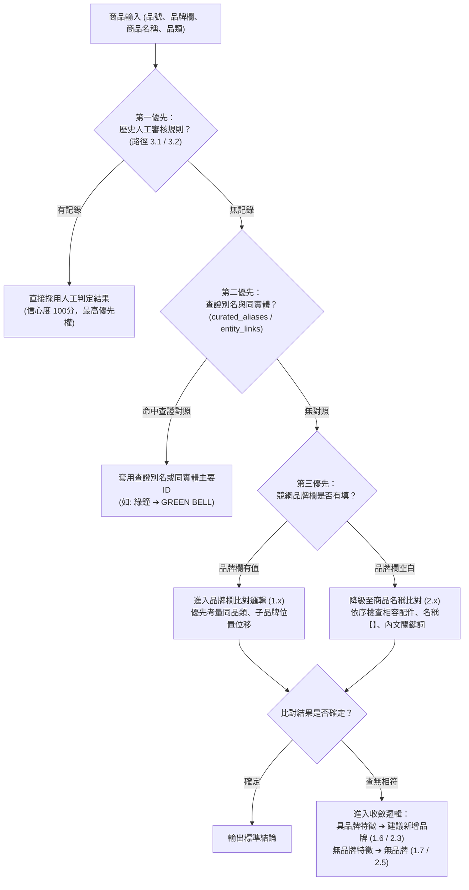

# 競網品牌對應作業說明書：判斷原則、流程與系統架構

**版本**：v1.4　｜　**適用範圍**：momo 站點商品（545,572 品號）　｜　**最近更新**：2026/09/21

---

## 1. 專案目標與總體決策階層（大規則）

### 1.1 作業目標
本作業旨在將競網（momo）商品中格式混亂的品牌文字（中英並列、母子品牌、型號混雜、無品牌或周邊配件等），標準化對應至既有之標準品牌庫，產出一致、乾淨且去重的商品品牌資料庫。

### 1.2 總體決策優先級（大規則）
系統在判定任何一筆商品時，並非隨機嘗試比對，而是嚴格依循以下**五層決策優先順序（Decision Hierarchy）**：



1. **第一優先：歷史人工審核記錄（最高權限）**
   - 凡是先前在審核表中經人工或 Temp 團隊確認過的品牌字串，系統直接沿用，絕不被演算法推翻。
2. **第二優先：經查證之別名與同實體關聯**
   - 官方中英文名稱對照（如「綠鐘 ➔ GREEN BELL」）或同品牌重複代碼（如 `H&H` 與 `Herb & Health`），優先於文字模糊猜測。
3. **第三優先：品牌欄位比對（1.x 路徑）**
   - 競網品牌欄有填時，以此欄位為主要依據，依序檢驗完全相符、子品牌位置優先、同實體主要 ID 等。
4. **第四優先：商品名稱降級比對（2.x 路徑）**
   - 品牌欄空白時，系統降級檢驗標題：優先排除相容周邊配件（如保護貼），再擷取標題開頭【】與內文關鍵詞。
5. **第五優先：新品牌建議與白牌收斂**
   - 文字具合法商標特徵但庫內無收錄者，歸為「建議新增品牌」；純規格詞、賣場描述或無資訊者，收斂為「無品牌」。

---

### 1.3 三大輸出類型定義

| 輸出類型 | 定義說明 | 系統標記 | 後續處置 |
|:---|:---|:---:|:---|
| **品牌庫品牌** | 商品成功對應至現有品牌庫中的正式品牌 | `TYPE_POOL` | 給予標準品牌代碼（`brand_id`），直接匯入下游商品庫。 |
| **建議新增品牌** | 商品具有明確品牌名稱，但現有品牌庫尚未收錄 | `TYPE_NEW` | 彙總產出建議清單，由品牌庫管理者評估收錄。 |
| **無品牌 (No brand)** | 商品為白牌、通用規格品，或屬於副廠配件 | `TYPE_NB` | 標記為無品牌，並記錄判定原因（如配件相容品、無品牌標示等）。 |

---

## 2. 判斷原則

### 原則一：以子品牌為主（最具體原則）
各品類（不論 3C 科技或美妝生活）標準保持一致，優先以最具體的子品牌為對應目標：
- **當母品牌與子品牌同時存在於品牌庫**：優先歸入子品牌。
  - 例：`Apple iPhone 15` ➔ 同時包含 Apple 與 iPhone ➔ **歸為 `iphone`**。
  - 例：`Kanebo KATE 凱婷 粉底液` ➔ 同時包含 Kanebo 與 KATE ➔ **歸為 `KATE 凱婷`**。
  - 例：`ASUS ROG 主機板` ➔ 同時包含 ASUS 與 ROG ➔ **歸為 `ROG`**。
- **當子品牌尚未建立於品牌庫**：歸入母品牌，不自行建立未確認之代碼。
  - 例：`Apple iPad Air` ➔ 品牌庫內有 Apple，但尚無 iPad 品牌 ➔ **依現有品牌庫邊界歸為 `Apple`**。

### 原則二：品類優先與避免跨類別誤判
- 比對時優先考量商品所屬之一級品類。
- 若商品文字僅局部包含某個品牌名稱，但兩者品類完全不符（例如書籍類漫畫《KING GOLF》包含單字 `GOLF`，而品牌庫中的 `GOLF` 登記為汽車配件），系統判定為不相符，避免跨品類誤對應。

### 原則三：短縮寫謹慎處理與防偽別名
- 1～3 個英文字母之短縮寫（如 GB、HH、HR），若中文名稱未獲正式證實，不自動建立中英連結。
- 例如競網出現「GB 綠鐘」（日本美甲工具），系統不會自動對應到母嬰品牌的「gb」，需由人工確認或透過官方查證後再行建檔。

### 原則四：同實體品牌合併
- 若品牌庫中存在因歷史建檔造成的同品牌重複代碼（如 `H&H` 與 `Herb & Health` 為同一品牌），在確認同實體後，依據歷史累積銷量收斂至主要代碼，避免資料庫重複割裂。

---

## 3. 全站 22 個品類目前對應成果總覽

以下為系統目前針對 momo 站點全品類跑完之最新統計數據：

| 一級品類 (Level 1) | 所屬群組 | 品號總數 | 品牌字串數 | 待審字串數 | 待審品號 (佔比) | 品牌庫命中率 | 建議新增率 | 無品牌率 |
|:---|:---:|---:|---:|---:|---:|:---:|:---:|:---:|
| **Books** | Lifestyle | 169,340 | 2,241 | 52 | 858 (1%) | 82% | 17% | 1% |
| **Home & Living** | FMCG | 84,916 | 14,360 | 3,478 | 12,696 (15%) | 65% | 24% | 11% |
| **Mother & Baby** | FMCG | 48,602 | 2,887 | 532 | 2,829 (6%) | 82% | 16% | 2% |
| **Mobile & Gadgets** | Electronics | 43,768 | 6,178 | 358 | 2,231 (5%) | 70% | 7% | 23% |
| **Beauty** | FMCG | 38,513 | 3,870 | 931 | 3,291 (9%) | 87% | 10% | 3% |
| **Hardware & 3C** | Electronics | 31,727 | 2,577 | 410 | 2,411 (8%) | 82% | 11% | 7% |
| **Food & Beverages** | FMCG | 24,466 | 3,609 | 736 | 1,889 (8%) | 73% | 17% | 10% |
| **Health** | FMCG | 17,821 | 2,303 | 412 | 1,513 (8%) | 80% | 16% | 4% |
| **Sports & Outdoors** | Lifestyle | 15,486 | 3,508 | 802 | 2,055 (13%) | 64% | 24% | 12% |
| **Home Electronic** | Electronics | 13,600 | 2,405 | 435 | 1,195 (9%) | 78% | 12% | 10% |
| **Pets** | FMCG | 10,167 | 2,124 | 433 | 1,229 (12%) | 69% | 20% | 11% |
| **Women's Apparel** | Fashion | 9,221 | 420 | 100 | 304 (3%) | 68% | 27% | 5% |
| **Women Accessories** | Fashion | 8,104 | 1,605 | 400 | 972 (12%) | 49% | 39% | 12% |
| **Life & Entertainment** | Lifestyle | 6,623 | 641 | 196 | 295 (4%) | 71% | 25% | 4% |
| **Motors** | Lifestyle | 6,478 | 1,444 | 261 | 756 (12%) | 69% | 18% | 13% |
| **Women Bags** | Fashion | 4,101 | 1,151 | 307 | 612 (15%) | 57% | 30% | 13% |
| **Men's Bags& Accessories** | Fashion | 3,373 | 483 | 106 | 252 (7%) | 78% | 17% | 5% |
| **Everything Else** | Lifestyle | 3,354 | 504 | 105 | 273 (8%) | 71% | 22% | 7% |
| **Game Kingdom** | Electronics | 2,469 | 193 | 35 | 112 (5%) | 92% | 2% | 6% |
| **Men's Apparel** | Fashion | 2,205 | 158 | 35 | 122 (6%) | 77% | 22% | 1% |
| **Shoes** | Fashion | 1,199 | 400 | 125 | 226 (19%) | 54% | 35% | 11% |
| **Tickets & Services** | Lifestyle | 39 | 7 | 1 | 1 (3%) | 97% | 3% | 0% |
| **全站總計** | — | **545,572** | **45,344** | **10,949** | **33,119 (6.1%)** | **75.5%** | **17.3%** | **7.2%** |

> **成效摘要**：全站 545,572 件商品中，**93.9%** 的商品已達成高確定性自動對應；僅剩 **6.1%**（約 3.3 萬件商品，對應約 1 萬個字串）需透過人工與 Temp 團隊審核。

---

## 4. 使用者與團隊協同作業流程

整體作業流程將繁雜的品號資料收斂為單一審核表，由 Temp 團隊進行批次標記後回灌系統：

```text
[步驟一: 資料匯入與預處理] ➔ [步驟二: 系統初判與規則匹配]
                                        ↓
[步驟四: Temp 團隊批次審核] 🠔 [步驟三: 打包產出全站審核總表 (Excel)]
        ↓
[步驟五: 審核表回灌系統] ➔ [步驟六: 規則永久保存並產出全站結果]
```

### 步驟一：資料匯入與預處理
- 載入競網原始商品資料（商品名稱、品牌欄、品類）與標準品牌庫。
- 系統自動去除公司組織別（如股份有限公司、生技、實業等）並完成文字標準化。

### 步驟二：系統初判與規則匹配
- 系統依照「大規則」優先順序進行匹配，計算 0～100 分之量化信心度。
- 遇到高疑義縮寫或缺中文品牌時，由 AI 輔助查證商標與官方背景，沉澱為靜態對照庫。

### 步驟三：打包產出全站審核總表給 Temp
- 執行指令：`py run.py bundle-export`
- 系統自動掃描 22 個品類，將所有待審品牌字串**去重合併為單一 Excel 總表**：
  `review/momo/_momo_全站審核總表_Temp用.xlsx`
- 表格已設定第一列凍結、欄寬自適應，並將「【人工】判斷」等填寫欄位以黃色高亮標註。

### 步驟四：Temp 團隊批次審核
- 將產出的 Excel 總表交由 Temp 團隊進行標記。
- Temp 於「【人工】判斷」欄位填寫代碼：
  - `v`：同意系統目前之建議。
  - `1` / `2` / `3`：從候選清單中挑選第 1、2 或 3 個品牌。
  - `新增品牌名稱`：若為新品牌，直接填入正確名稱。
  - `No brand`：確認該項目為無品牌或周邊配件。
  - `留空`：暫不處理，系統維持原建議。
  - `-`：清除先前的判斷。

### 步驟五：收回審核檔並一鍵回灌規則庫
- 收回 Temp 填寫後的 Excel 檔案。
- 執行指令：`py run.py bundle-import`
- 系統自動將所有審核紀錄寫入 SQLite 規則庫（`brand_rules.db`），並自動提煉中英別名。

### 步驟六：全站自動套用並產出結果總表
- 執行指令：`py run.py tag --all`
- 規則庫中的決策立即向全站 22 個品類廣播生效，自動產出品號層級之結果明細檔（`output/momo/<品類>_result.xlsx`）。

---

## 5. 決策路徑與規則對照表

點擊下方區塊可展開檢視各層級之具體判定條件與實例說明：

???+ info "層級一：品牌欄有填之判斷路徑 (1.1 ～ 1.7)"
    | 路徑代碼 | 判斷情況 | 判定結果 | 信心度 | 典型範例說明 |
    |:---:|:---|:---:|:---:|:---|
    | **1.1** | 品牌欄文字標示無品牌 | 無品牌 | 97 | 品牌欄填寫「無品牌」、「其他」、「OEM」 |
    | **1.2** | 品牌欄文字為相容描述 | 無品牌 | 90 | 品牌欄填寫「適用 iPhone 充電線」 |
    | **1.3** | 品牌庫完全相符（含子品牌優先） | 品牌庫品牌 | 96 | 「DHC」完全相符；「Apple iPhone」取子品牌 `iphone` |
    | **1.4** | 品牌庫有多筆重複，依業績取主要品牌 | 品牌庫品牌 | 90 | 品牌庫同時有 `LUX` 與 `Lux`，取銷量最高之主要 ID |
    | **1.5** | 多個不同品牌同時相符，需人工確認 | 品牌庫品牌 | 39 | 品牌欄填「日本」，同時命中多個品牌，同分送審 |
    | **1.6** | 有品牌特徵，但現有品牌庫查無 | 建議新增品牌 | 82 | 「茉家」、「AHOYE」，字面具品牌特徵但庫內無 |
    | **1.7** | 品牌欄內容為規格或品類描述詞 | 無品牌 | 80 | 品牌欄填寫「收納用品」、「特價出清」 |

???+ info "層級二：品牌欄空白之判斷路徑 (2.1 ～ 2.5)"
    | 路徑代碼 | 判斷情況 | 判定結果 | 信心度 | 典型範例說明 |
    |:---:|:---|:---:|:---:|:---|
    | **2.1** | 商品為配件或相容周邊 | 無品牌 | 88 | 標題「iPhone 15 鋼化保護貼」，本體非蘋果商品 |
    | **2.2** | 商品名稱開頭【】命中品牌庫 | 品牌庫品牌 | 86 | 商品名稱為「【Innisfree】綠茶保濕精華」 |
    | **2.3** | 商品名稱開頭【】為新品牌 | 建議新增品牌 | 72 | 商品名稱為「【MEIDIAN】固體面膜棒」，庫中查無 |
    | **2.4** | 由商品標題內文中段比對到品牌 | 品牌庫品牌 | 52 | 標題內文中出現特定長字串品牌名稱 |
    | **2.5** | 標題與內文皆無可信品牌資訊 | 無品牌 | 85 | 標題為純描述性商品名（如「加厚純棉毛巾」） |

???+ info "層級三：歷史審核記憶與人工覆蓋機制 (3.1 ～ 3.2)"
    > **特別說明（為什麼有這兩條規則？業務或主管需要事先手動建檔嗎？）**  
    > **不需要事先手動建檔。** 系統在初次運作時，此處記錄為 0 筆。這兩條規則是系統的**「學習與記憶容器」**：當 Temp 團隊或業務人員把審核 Excel 填妥並回灌系統後，系統會自動將確認過的品牌對應永久寫入資料庫（`brand_rules.db`）。日後全站若再次出現相同的品牌字串，系統就會依 3.1 優先自動沿用，免去重複人工審核。

    * **3.1 套用歷史審核品牌字串（全站共用）**：
      先前已在審核表中確認過的品牌字串，全站 22 個品類若再次出現，系統直接沿用該判定結果（信心度 100 分，最高優先權）。
    * **3.2 套用單一品號例外覆蓋（單品專屬）**：
      僅用於極少數「字串本身不能改，但某特定單一品號需例外指定品牌」之特殊情況（信心度 100 分）。

---

## 6. 信心度指標與審核建議

系統產出的每一筆對應結果皆附帶 **0～100 分之信心度**，作為人工檢核之優先順序依據：

| 信心度區間 | 確定程度 | 商品占比 | 建議作業方式 |
|:---:|:---:|:---:|:---|
| **90～100 分** | 高度確定 | 約 75.5% | 系統判定明確無爭議，可直接採用，無須耗費人力審核。 |
| **75～89 分** | 大致可信 | 約 18.4% | 結果具可信度。系統於工作簿中隨機標註「★」，每品類僅需抽檢約 30 筆即可確認品質。 |
| **0～74 分** | 需人工確認 | 約 6.1% | 包含全新品牌、多品牌同分歧義或短縮寫。系統將其集中於審核工作簿最上方，由 Temp 團隊優先確認。 |

---

## 7. 系統架構、技術實作與資料結構

### 7.1 系統分層架構
系統採用模組化設計，各層職責分離，確保維護性與可擴展性：

1. **資料來源層 (`brandtag/source.py`)**：負責讀取競網 raw SQLite，並自動快取為品號唯一資料表。
2. **文字前處理層 (`brandtag/text.py`)**：執行字符正規化、法人組織別剝離、中英文拆分。
3. **比對與索引引擎 (`brandtag/index.py`, `engine.py`)**：維護雙向倒排索引，計算子品牌跨度與信心度。
4. **規則儲存層 (`brandtag/store.py`)**：使用 SQLite 實作 Append-Only 決策日誌與狀態重算。
5. **審核與整合層 (`brandtag/bundle.py`, `review.py`)**：負責產生多品類審核檔及全站總表。

---

### 7.2 核心比對技術與演算法

1. **子品牌位移跨度分析（Span Offset Analysis）**：
   電商命名慣例普遍為 `[母品牌] [子品牌]`。系統在檢索到多個候選時，比對候選在原始字串中的起始位移（Offset），優先選取位置靠後之子品牌（如 `Apple` 位於 0，`iPhone` 位於 6，系統選取 `iPhone`）。
2. **跨類別部分分詞懲罰**：
   當候選品牌所屬品類與商品所屬品類不一致，且僅為分詞命中（非完全相符）時，系統施加 30 分之懲罰權重並直接否決，杜絕如書籍漫畫《KING GOLF》誤配汽配零件之情形。
3. **Levenshtein 拼字距離容錯**：
   針對長英文品牌（長度 ≥ 5），允許 1～2 個字元之拼寫差異容錯，同時設定 88% 之嚴格門檻，避免誤命中短單字。

---

### 7.3 外部查證機制（AI 輔助商標官網查證）
- **程式本體離線運行**：Python 比對引擎完全在本地離線運算，不依賴任何外部網路，速度快且穩定。
- **AI 輔助查證時機**：在人機協調分析過程中，針對高疑義縮寫（如 `GB`、`HH`）由 AI 連線查詢經濟部智慧財產局商標檢索系統與官網背景，確認真實中英對照後，整理成靜態對照表。

---

### 7.4 規則資料庫與對照表實例節錄

所有規則皆獨立於原始商品資料儲存，歷程永不丟失：

#### 1. 人工決策歷程表（`decision_log` in `brand_rules.db`）
記錄每一次人工確認的操作者、時間、原系統建議與修改值（只增不減）：

| log_id | 記錄時間 | 操作者 | 品牌字串 | 最終判定結果 | 對應 brand_id | 備註說明 |
|:---:|:---:|:---:|:---:|:---:|:---:|:---|
| #101 | 2026-09-20 14:22 | UserA | `B:dhc` | 品牌庫品牌 | 1100123 | 同意系統原建議 |
| #102 | 2026-09-20 15:05 | UserA | `B:gb 綠鐘` | 品牌庫品牌 | 1124530 | 經查為 GREEN BELL，非母嬰 gb |
| #103 | 2026-09-20 16:30 | Temp1 | `T:iphone保護貼` | No brand | 0 | 配件相容品，非原廠品牌 |

#### 2. 已查證中英別名表（[`curated_aliases.csv`](file:///c:/Users/SCTTW0989/Desktop/brand_tagging/curated_aliases.csv)）
```csv
中文品牌名,brand_id,英文官方名,查證來源與備註
綠鐘,1124530,GREEN BELL,日本百年鍛造美甲工具品牌，非好孩子推車 gb
理膚寶水,1100456,La Roche-Posay,台灣萊雅代理之醫美保養品牌
草本新淨界,1111148,Herb & Health,女性私密護理品牌 HH
```

#### 3. 已查證同實體品牌表（[`curated_entity_links.csv`](file:///c:/Users/SCTTW0989/Desktop/brand_tagging/curated_entity_links.csv)）
```csv
brand_id_a,brand_id_b,品牌名稱,備註說明
1120001,1111148,H&H ↔ Herb & Health,經查為同一實體，依累積銷量自動收斂至 1111148
1104521,1104522,LUX ↔ Lux 麗仕,大小寫重複建檔，自動收斂至主要 ID
```

---

## 8. 常見問題說明 (FAQ)

**Q1：為什麼同一商品在不同品類時，比對結果可能不同？**
> **說明**：為避免跨領域誤判，系統嚴格遵守品類邊界。例如同樣出現「PUMA」，在運動品類會直接對應運動品牌；但若在其他五金品類出現相同字串，系統不會自動套用運動品牌，以確保資料正確。

**Q2：人工標記時如果留空，原本審核過的資料會被清掉嗎？**
> **說明**：不會。「留空」代表維持現狀，系統會繼續套用先前的判定。若需正式取消先前的判斷，需在該格輸入「`-`」。

**Q3：競網日後更新資料批次時，之前審核過的成果需要重做嗎？**
> **說明**：不需要。所有審核過的品牌字串皆已儲存在資料庫中。重新執行新資料時，已審過的字串會自動套用（節點 3.1），只有未曾見過的新字串才會列入待審清單。

**Q4：為什麼決策階層圖的第一優先是人工規則？但我先前沒有手動建過規則？**
> **說明**：3.1 與 3.2 是系統的「自動回灌記憶機制」，不是要求人員手動逐筆建檔。在專案尚未回灌任何審核表前，此庫記錄為 0 筆，系統會自動順暢進入第二、第三優先由演算法自動比對。一旦 Temp 團隊的審核表回灌後，系統就會將確認過之字串以此規則優先沿用，確保人工審定的結果絕不被演算法推翻。

**Q5：系統是否有依賴外部網路連線？**
> **說明**：主程式與 22 個品類之比對運算完全在本地端離線執行，確保速度與穩定性。僅在開發與規則調優階段，針對少數極具爭議的英文縮寫，由專案團隊輔助查詢智財局商標公報與官網，並將確認後之結果固化為靜態對照檔。
